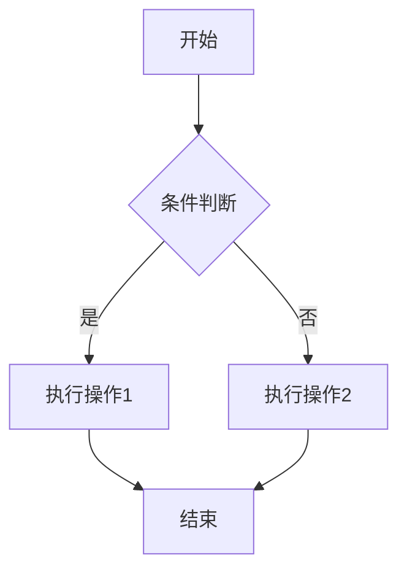
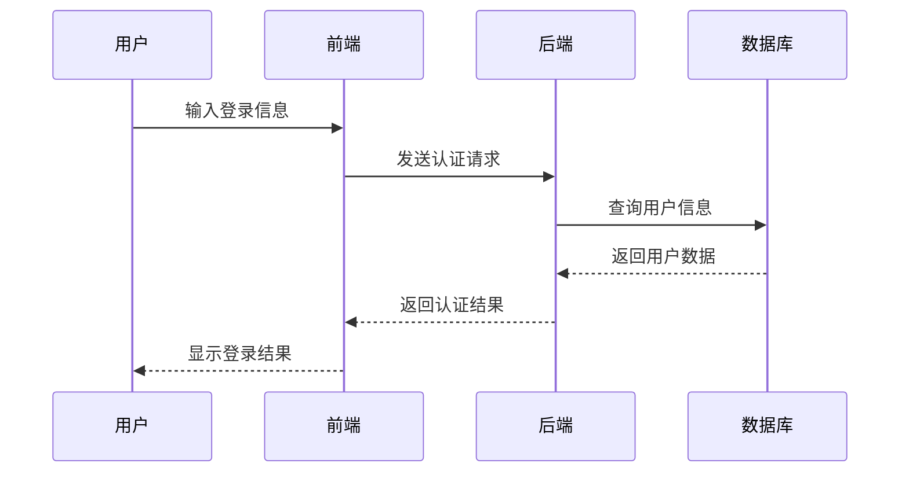
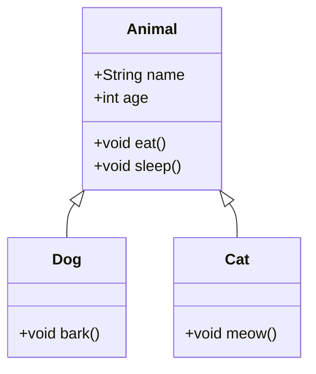
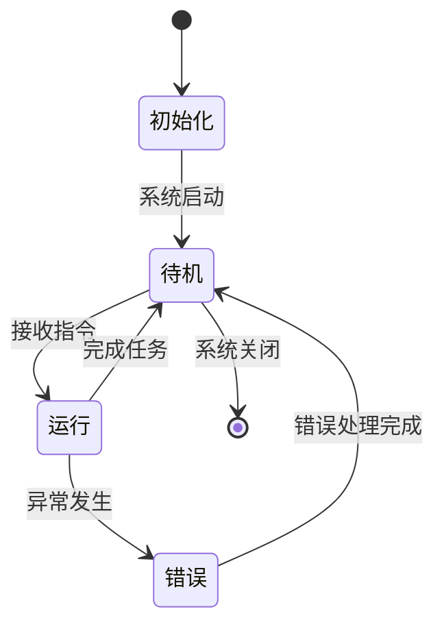
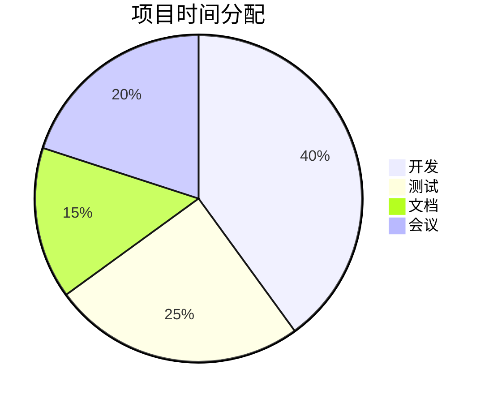

# Markdown 全面测试文档

本文档旨在测试 Markdown 的各种格式、代码块以及 Mermaid 流程图功能。

---

## 1. 标题

### 1.1 二级标题dddd

#### 1.1.1 三级标题

##### 1.1.1.1 四级标题

###### 1.1.1.1.1 五级标题

###### 1.1.1.1.1.1 六级标题

---

## 2. 段落与换行

这是第一段。  
这是同一段内的换行（使用两个空格 + 回车）。

这是新的一段（空一行）。

---

## 3. 强调

- **粗体**：使用 `**粗体**` 或 `__粗体__`
- *斜体*：使用 `*斜体*` 或 `_斜体_`
- ***粗斜体***：使用 `***粗斜体***` 或 `___粗斜体___`
- ~~删除线~~：使用 `~~删除线~~`

---

## 4. 列表

### 4.1 无序列表

- 项目一
- 项目二
  - 子项目 2.1
  - 子项目 2.2
    - 子子项目 2.2.1

### 4.2 有序列表

1. 第一项
2. 第二项
   1. 子项 2.1
   2. 子项 2.2
3. 第三项

### 4.3 任务列表

- [x] 完成任务一
- [ ] 未完成任务二
- [x] 完成任务三

---

## 5. 引用

> 这是一个引用块。
> 
> 引用可以包含多行。
> 
> > 这是嵌套引用。

---

## 6. 代码

### 6.1 行内代码

使用 `console.log()` 输出信息。

### 6.2 代码块

#### Python

```python
def fibonacci(n):
'''demo'''
    if n <= 1:
        return n
    return fibonacci(n - 1) + fibonacci(n - 2)

print(fibonacci(10))
```

#### JavaScript

```javascript
const greet = (name) => {
  console.log(`Hello, ${name}!`);
};

greet('World');
```

#### Java

```java
public class HelloWorld {
    public static void main(String[] args) {
        System.out.println("Hello, World!");
    }
}
```

#### Bash

```bash
#!/bin/bash
echo "当前目录：$(pwd)"
ls -la
```

#### JSON

```json
{
  "name": "Markdown Test",
  "version": "1.0.0",
  "dependencies": {
    "markdown-it": "^12.0.0"
  }
}
```

#### XML

```xml
<?xml version="1.0" encoding="UTF-8"?>
<bookstore>
  <book category="fiction">
    <title lang="en">The Great Gatsby</title>
    <author>F. Scott Fitzgerald</author>
  </book>
</bookstore>
```

#### 无语言标识

```
这是一个没有指定语言的代码块
可以包含任意内容
```

---

## 7. 表格

| 序号 | 语言     | 用途           | 难度 |
|------|----------|----------------|------|
| 1    | Python   | 数据分析、AI   | ⭐⭐  |
| 2    | JavaScript | Web 开发      | ⭐⭐⭐ |
| 3    | Java     | 企业级应用     | ⭐⭐⭐⭐ |
| 4    | C++      | 系统编程       | ⭐⭐⭐⭐⭐ |

对齐方式：

| 左对齐 | 居中对齐 | 右对齐 |
|:-------|:-------:|-------:|
| 文本   | 文本    | 文本   |

---

## 8. 链接与图片

### 8.1 链接

- [GitHub](https://github.com)
- [相对链接](./README.md)
- [带标题的链接](https://www.example.com "示例网站")

### 8.2 图片


---

## 9. 分隔线

---

***

___

---

## 10. 转义字符

\*这不是斜体\*  
\*\*这不是粗体\*\*  
\# 这不是标题

---

## 11. HTML 支持

<div style="background-color: #f0f0f0; padding: 10px; border-radius: 5px;">
  <p>这是一个 HTML div 元素</p>
  <ul>
    <li>支持 HTML 标签</li>
    <li>但不推荐过度使用</li>
  </ul>
</div>

---

## 12. Mermaid 流程图

### 12.1 基本流程图



### 12.2 时序图



### 12.3 类图



### 12.4 状态图



### 12.5 饼图



---

## 13. 脚注

这是一个包含脚注的句子[^1]。

[^1]: 这是脚注的内容，可以包含链接 [GitHub](https://github.com) 和其他格式。

---

## 14. 定义列表

Markdown 标准不支持定义列表，但某些扩展支持：

Apple
:   Pomaceous fruit of plants of the genus Malus in the family Rosaceae.

Orange
:   The fruit of an evergreen tree of the genus Citrus.

---

## 15. 内嵌 HTML

<details>
<summary>点击展开详细信息</summary>

这是一个可折叠的详细信息块，使用 HTML `<details>` 标签实现。

- 支持列表
- 支持**格式化文本**
- 支持代码：`console.log('Hello')`

</details>

---

> **注意**：不同 Markdown 解析器对某些语法的支持可能有所不同。本文档基于 CommonMark 标准，并包含一些扩展语法（如 Mermaid、脚注等）。